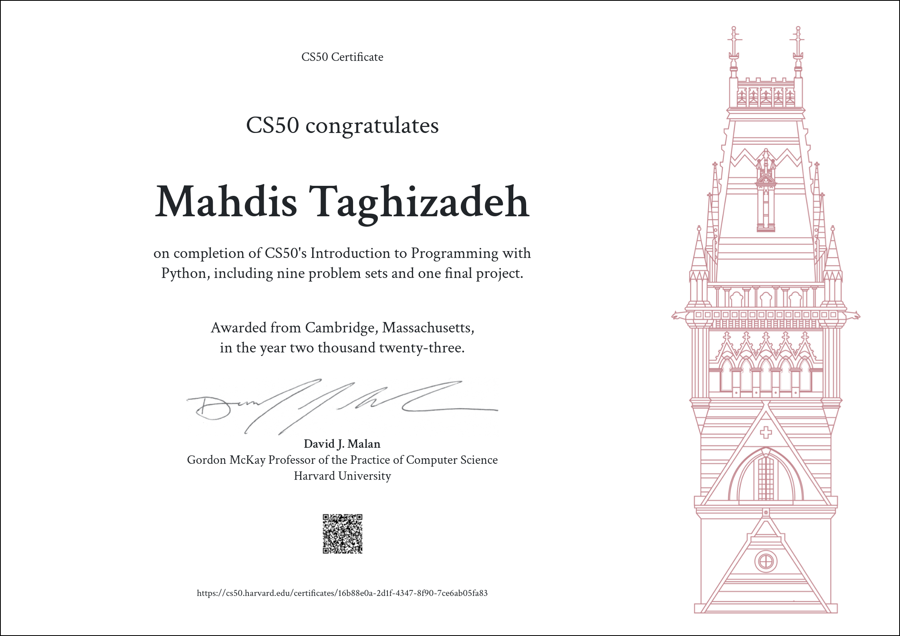

# CS50’s Introduction to Programming with Python

### These are my solutions for [CS50's Introduction to Programming with Python 2022](https://cs50.harvard.edu/python/2022/).

### Final Project: [YouTube Downloader](/project/YouTobeDownloader/)

## :warning: Disclaimer:

### ❗ **The following codes are for educational purpose only and not intended to be used / submitted as your own solutions.**

### ❗ **Cheating violates the [Academic Honesty](https://cs50.harvard.edu/python/2022/honesty/) of the course, not to mention it's totally pointless if you actually want to learn programming.**
